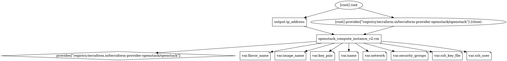

# OpenStack and nginx
An example of deployment for nginx in a Docker container. 

## Table of Contents
  - [Description](#description)
  - [Prerequisites](#prerequisites)
  - [Running with Terraform](#running-with-terraform)
  - [Diagrams](#diagrams)

## Description
This example shows how to deploy and set up an OpenStack VM and an nginx site on top of it.

After the deployment the sample HTML website will be available on `<YOUR_VM_IP>:80`, so make sure that you unlock the
(ingress) port `80` within the specified OpenStack security group.

## Prerequisites
First you will need to install Terraform. On Linux distributions you can run the following commands (on other OS 
follow [these](https://learn.hashicorp.com/tutorials/terraform/install-cli) instructions):

```console
$ sudo apt-get update && sudo apt-get install -y gnupg software-properties-common curl
$ curl -fsSL https://apt.releases.hashicorp.com/gpg | sudo apt-key add -
$ sudo apt-add-repository "deb [arch=amd64] https://apt.releases.hashicorp.com $(lsb_release -cs) main"
$ sudo apt-get update && sudo apt-get install terraform
$ terraform -help
```

Before we can actually use the OpenStack functionality, we also need to obtain the OpenStack credentials. 
If we log into OpenStack and navigate to the `Access & Security` -\> `API Access` page, we can download the rc file 
with all required information.

At the start of each session (e.g., when we open a new command line console), we must source the rc file by running:

```console
$ . openstack.rc
```

After we enter the password, we are ready to start using the OpenStack plugins for Terraform that implement life 
cycle operations.

Before running you should modify the input values in `variables.tf`.
The deployment assumes that you have already uploaded an SSH key pair on your OpenStack and that you have a private key
file locally available.
If you cannot access the output IP you will probably need to assign floating IP to the VM.

# Running with Terraform
We can first initialize the project (downloads a plugin that allows Terraform to interact with Docker):

```console
$ cd sandbox/terraform/nginx-openstack
sandbox/terraform/nginx-openstack$ terraform init

Initializing the backend...

Initializing provider plugins...
- Finding terraform-provider-openstack/openstack versions matching "~> 1.47.0"...
- Installing terraform-provider-openstack/openstack v1.47.0...
- Installed terraform-provider-openstack/openstack v1.47.0 (self-signed, key ID 4F80527A391BEFD2)

Partner and community providers are signed by their developers.
If you'd like to know more about provider signing, you can read about it here:
https://www.terraform.io/docs/cli/plugins/signing.html

Terraform has created a lock file .terraform.lock.hcl to record the provider
selections it made above. Include this file in your version control repository
so that Terraform can guarantee to make the same selections by default when
you run "terraform init" in the future.

Terraform has been successfully initialized!

You may now begin working with Terraform. Try running "terraform plan" to see
any changes that are required for your infrastructure. All Terraform commands
should now work.

If you ever set or change modules or backend configuration for Terraform,
rerun this command to reinitialize your working directory. If you forget, other
commands will detect it and remind you to do so if necessary.
```

We can then validate our configuration as follows:

```console
sandbox/terraform/nginx-openstack$ terraform validate
Success! The configuration is valid.
```

We can then preview our execution plan:

```console
sandbox/terraform/nginx-openstack$ terraform plan

Terraform used the selected providers to generate the following execution plan. Resource actions are indicated with the following symbols:
  + create

Terraform will perform the following actions:

  # openstack_compute_instance_v2.vm will be created
  + resource "openstack_compute_instance_v2" "vm" {
      + access_ip_v4        = (known after apply)
      + access_ip_v6        = (known after apply)
      + all_metadata        = (known after apply)
      + all_tags            = (known after apply)
      + availability_zone   = (known after apply)
      + flavor_id           = (known after apply)
      + flavor_name         = "small"
      + force_delete        = false
      + id                  = (known after apply)
      + image_id            = (known after apply)
      + image_name          = "ubuntu-20.04.3"
      + key_pair            = "key-pair"
      + name                = "nginx-host"
      + power_state         = "active"
      + region              = (known after apply)
      + security_groups     = [
          + "default",
          + "my-group",
        ]
      + stop_before_destroy = false

      + network {
          + access_network = false
          + fixed_ip_v4    = (known after apply)
          + fixed_ip_v6    = (known after apply)
          + floating_ip    = (known after apply)
          + mac            = (known after apply)
          + name           = "ostack2"
          + port           = (known after apply)
          + uuid           = (known after apply)
        }
    }

Plan: 1 to add, 0 to change, 0 to destroy.

Changes to Outputs:
  + ip_address = (known after apply)
```

Then we can apply the configuration and deploy the example as follows:

```console
sandbox/terraform/nginx-openstack$ terraform apply -auto-approve

Terraform used the selected providers to generate the following execution plan. Resource actions are indicated with the following symbols:
  + create

Terraform will perform the following actions:

  # openstack_compute_instance_v2.vm will be created
  + resource "openstack_compute_instance_v2" "vm" {
      + access_ip_v4        = (known after apply)
      + access_ip_v6        = (known after apply)
      + all_metadata        = (known after apply)
      + all_tags            = (known after apply)
      + availability_zone   = (known after apply)
      + flavor_id           = (known after apply)
      + flavor_name         = "small"
      + force_delete        = false
      + id                  = (known after apply)
      + image_id            = (known after apply)
      + image_name          = "ubuntu-20.04.3"
      + key_pair            = "key-pair"
      + name                = "nginx-host"
      + power_state         = "active"
      + region              = (known after apply)
      + security_groups     = [
          + "default",
          + "my-group",
        ]
      + stop_before_destroy = false

      + network {
          + access_network = false
          + fixed_ip_v4    = (known after apply)
          + fixed_ip_v6    = (known after apply)
          + floating_ip    = (known after apply)
          + mac            = (known after apply)
          + name           = "ostack2"
          + port           = (known after apply)
          + uuid           = (known after apply)
        }
    }

Plan: 1 to add, 0 to change, 0 to destroy.

Changes to Outputs:
  + ip_address = (known after apply)
openstack_compute_instance_v2.vm: Creating...
openstack_compute_instance_v2.vm: Still creating... [10s elapsed]
openstack_compute_instance_v2.vm: Provisioning with 'remote-exec'...
openstack_compute_instance_v2.vm (remote-exec): Connecting to remote host via SSH...
openstack_compute_instance_v2.vm (remote-exec):   Host: 203.0.113.10
openstack_compute_instance_v2.vm (remote-exec):   User: ubuntu
openstack_compute_instance_v2.vm (remote-exec):   Password: false
openstack_compute_instance_v2.vm (remote-exec):   Private key: true
openstack_compute_instance_v2.vm (remote-exec):   Certificate: false
openstack_compute_instance_v2.vm (remote-exec):   SSH Agent: true
openstack_compute_instance_v2.vm (remote-exec):   Checking Host Key: false
openstack_compute_instance_v2.vm (remote-exec):   Target Platform: unix
openstack_compute_instance_v2.vm (remote-exec): Connecting to remote host via SSH...
openstack_compute_instance_v2.vm (remote-exec):   Host: 203.0.113.10
openstack_compute_instance_v2.vm (remote-exec):   User: ubuntu
openstack_compute_instance_v2.vm (remote-exec):   Password: false
openstack_compute_instance_v2.vm (remote-exec):   Private key: true
openstack_compute_instance_v2.vm (remote-exec):   Certificate: false
openstack_compute_instance_v2.vm (remote-exec):   SSH Agent: true
openstack_compute_instance_v2.vm (remote-exec):   Checking Host Key: false
openstack_compute_instance_v2.vm (remote-exec):   Target Platform: unix
openstack_compute_instance_v2.vm: Still creating... [20s elapsed]
openstack_compute_instance_v2.vm (remote-exec): Connecting to remote host via SSH...
openstack_compute_instance_v2.vm (remote-exec):   Host: 203.0.113.10
openstack_compute_instance_v2.vm (remote-exec):   User: ubuntu
openstack_compute_instance_v2.vm (remote-exec):   Password: false
openstack_compute_instance_v2.vm (remote-exec):   Private key: true
openstack_compute_instance_v2.vm (remote-exec):   Certificate: false
openstack_compute_instance_v2.vm (remote-exec):   SSH Agent: true
openstack_compute_instance_v2.vm (remote-exec):   Checking Host Key: false
openstack_compute_instance_v2.vm (remote-exec):   Target Platform: unix
openstack_compute_instance_v2.vm (remote-exec): Connecting to remote host via SSH...
openstack_compute_instance_v2.vm (remote-exec):   Host: 203.0.113.10
openstack_compute_instance_v2.vm (remote-exec):   User: ubuntu
openstack_compute_instance_v2.vm (remote-exec):   Password: false
openstack_compute_instance_v2.vm (remote-exec):   Private key: true
openstack_compute_instance_v2.vm (remote-exec):   Certificate: false
openstack_compute_instance_v2.vm (remote-exec):   SSH Agent: true
openstack_compute_instance_v2.vm (remote-exec):   Checking Host Key: false
openstack_compute_instance_v2.vm (remote-exec):   Target Platform: unix
openstack_compute_instance_v2.vm: Still creating... [30s elapsed]
openstack_compute_instance_v2.vm (remote-exec): Connecting to remote host via SSH...
openstack_compute_instance_v2.vm (remote-exec):   Host: 203.0.113.10
openstack_compute_instance_v2.vm (remote-exec):   User: ubuntu
openstack_compute_instance_v2.vm (remote-exec):   Password: false
openstack_compute_instance_v2.vm (remote-exec):   Private key: true
openstack_compute_instance_v2.vm (remote-exec):   Certificate: false
openstack_compute_instance_v2.vm (remote-exec):   SSH Agent: true
openstack_compute_instance_v2.vm (remote-exec):   Checking Host Key: false
openstack_compute_instance_v2.vm (remote-exec):   Target Platform: unix
openstack_compute_instance_v2.vm (remote-exec): Connected!
openstack_compute_instance_v2.vm (remote-exec): 0% [Working]
openstack_compute_instance_v2.vm (remote-exec): Hit:1 http://nova.clouds.archive.ubuntu.com/ubuntu focal InRelease
openstack_compute_instance_v2.vm (remote-exec): 0% [Waiting for headers] [Connecting to
openstack_compute_instance_v2.vm (remote-exec): Get:2 http://nova.clouds.archive.ubuntu.com/ubuntu focal-updates InRelease [114 kB]
openstack_compute_instance_v2.vm (remote-exec): 0% [2 InRelease 14.2 kB/114 kB 12%] [Co
openstack_compute_instance_v2.vm (remote-exec): 0% [Waiting for headers] [Waiting for h
openstack_compute_instance_v2.vm (remote-exec): 0% [Waiting for headers] [Waiting for h
openstack_compute_instance_v2.vm (remote-exec): Get:3 http://nova.clouds.archive.ubuntu.com/ubuntu focal-backports InRelease [108 kB]
openstack_compute_instance_v2.vm (remote-exec): 0% [3 InRelease 4051 B/108 kB 4%] [Wait
openstack_compute_instance_v2.vm (remote-exec): Get:4 http://security.ubuntu.com/ubuntu focal-security InRelease [114 kB]
openstack_compute_instance_v2.vm (remote-exec): 0% [3 InRelease 34.5 kB/108 kB 32%] [4
openstack_compute_instance_v2.vm (remote-exec): 0% [4 InRelease 14.2 kB/114 kB 12%]
openstack_compute_instance_v2.vm (remote-exec): Get:5 http://nova.clouds.archive.ubuntu.com/ubuntu focal/universe amd64 Packages [8628 kB]
openstack_compute_instance_v2.vm (remote-exec): 0% [5 Packages 5581 B/8628 kB 0%] [4 In
openstack_compute_instance_v2.vm (remote-exec): 0% [5 Packages 407 kB/8628 kB 5%] [4 In
openstack_compute_instance_v2.vm (remote-exec): 0% [4 InRelease 101 kB/114 kB 89%]
openstack_compute_instance_v2.vm (remote-exec): Get:6 http://nova.clouds.archive.ubuntu.com/ubuntu focal/universe Translation-en [5124 kB]
openstack_compute_instance_v2.vm (remote-exec): 0% [6 Translation-en 680 kB/5124 kB 13%
openstack_compute_instance_v2.vm (remote-exec): 0% [5 Packages store 0 B] [6 Translatio
openstack_compute_instance_v2.vm (remote-exec): 0% [5 Packages store 0 B] [6 Translatio
openstack_compute_instance_v2.vm (remote-exec): 0% [5 Packages store 0 B] [6 Translatio
openstack_compute_instance_v2.vm (remote-exec): 0% [5 Packages store 0 B]
openstack_compute_instance_v2.vm (remote-exec): Get:7 http://nova.clouds.archive.ubuntu.com/ubuntu focal/universe amd64 c-n-f Metadata [265 kB]
openstack_compute_instance_v2.vm (remote-exec): 0% [5 Packages store 0 B] [7 Commands-a
openstack_compute_instance_v2.vm (remote-exec): 0% [5 Packages store 0 B]
openstack_compute_instance_v2.vm (remote-exec): Get:8 http://nova.clouds.archive.ubuntu.com/ubuntu focal/multiverse amd64 Packages [144 kB]
openstack_compute_instance_v2.vm (remote-exec): 0% [5 Packages store 0 B] [8 Packages 0
openstack_compute_instance_v2.vm (remote-exec): 0% [5 Packages store 0 B]
openstack_compute_instance_v2.vm (remote-exec): Get:9 http://nova.clouds.archive.ubuntu.com/ubuntu focal/multiverse Translation-en [104 kB]
openstack_compute_instance_v2.vm (remote-exec): 0% [5 Packages store 0 B] [9 Translatio
openstack_compute_instance_v2.vm (remote-exec): 0% [5 Packages store 0 B]
openstack_compute_instance_v2.vm (remote-exec): Get:10 http://nova.clouds.archive.ubuntu.com/ubuntu focal/multiverse amd64 c-n-f Metadata [9136 B]
openstack_compute_instance_v2.vm (remote-exec): 0% [5 Packages store 0 B] [10 Commands-
openstack_compute_instance_v2.vm (remote-exec): 0% [5 Packages store 0 B]
openstack_compute_instance_v2.vm (remote-exec): Get:11 http://nova.clouds.archive.ubuntu.com/ubuntu focal-updates/main amd64 Packages [1604 kB]
openstack_compute_instance_v2.vm (remote-exec): 0% [5 Packages store 0 B] [11 Packages
openstack_compute_instance_v2.vm (remote-exec): 0% [5 Packages store 0 B]
openstack_compute_instance_v2.vm (remote-exec): Get:12 http://nova.clouds.archive.ubuntu.com/ubuntu focal-updates/main Translation-en [308 kB]
openstack_compute_instance_v2.vm (remote-exec): 0% [5 Packages store 0 B] [12 Translati
openstack_compute_instance_v2.vm (remote-exec): 0% [5 Packages store 0 B]
openstack_compute_instance_v2.vm (remote-exec): Get:13 http://nova.clouds.archive.ubuntu.com/ubuntu focal-updates/main amd64 c-n-f Metadata [14.8 kB]
openstack_compute_instance_v2.vm (remote-exec): 0% [5 Packages store 0 B] [13 Commands-
openstack_compute_instance_v2.vm (remote-exec): 0% [5 Packages store 0 B]
openstack_compute_instance_v2.vm (remote-exec): Get:14 http://nova.clouds.archive.ubuntu.com/ubuntu focal-updates/restricted amd64 Packages [823 kB]
openstack_compute_instance_v2.vm (remote-exec): 0% [5 Packages store 0 B] [14 Packages
openstack_compute_instance_v2.vm (remote-exec): 0% [5 Packages store 0 B]
openstack_compute_instance_v2.vm (remote-exec): Get:15 http://nova.clouds.archive.ubuntu.com/ubuntu focal-updates/restricted Translation-en [117 kB]
openstack_compute_instance_v2.vm (remote-exec): 0% [5 Packages store 0 B] [15 Translati
openstack_compute_instance_v2.vm (remote-exec): 0% [5 Packages store 0 B]
openstack_compute_instance_v2.vm (remote-exec): Get:16 http://nova.clouds.archive.ubuntu.com/ubuntu focal-updates/restricted amd64 c-n-f Metadata [500 B]
openstack_compute_instance_v2.vm (remote-exec): 0% [5 Packages store 0 B] [16 Commands-
openstack_compute_instance_v2.vm (remote-exec): 0% [5 Packages store 0 B]
openstack_compute_instance_v2.vm (remote-exec): Get:17 http://nova.clouds.archive.ubuntu.com/ubuntu focal-updates/universe amd64 Packages [905 kB]
openstack_compute_instance_v2.vm (remote-exec): 0% [5 Packages store 0 B] [17 Packages
openstack_compute_instance_v2.vm (remote-exec): 0% [5 Packages store 0 B]
openstack_compute_instance_v2.vm (remote-exec): Get:18 http://nova.clouds.archive.ubuntu.com/ubuntu focal-updates/universe Translation-en [201 kB]
openstack_compute_instance_v2.vm (remote-exec): 0% [5 Packages store 0 B] [18 Translati
openstack_compute_instance_v2.vm (remote-exec): 0% [5 Packages store 0 B]
openstack_compute_instance_v2.vm (remote-exec): Get:19 http://nova.clouds.archive.ubuntu.com/ubuntu focal-updates/universe amd64 c-n-f Metadata [20.1 kB]
openstack_compute_instance_v2.vm (remote-exec): 0% [5 Packages store 0 B] [19 Commands-
openstack_compute_instance_v2.vm (remote-exec): 0% [5 Packages store 0 B]
openstack_compute_instance_v2.vm (remote-exec): Get:20 http://nova.clouds.archive.ubuntu.com/ubuntu focal-updates/multiverse amd64 Packages [23.7 kB]
openstack_compute_instance_v2.vm (remote-exec): 0% [5 Packages store 0 B] [20 Packages
openstack_compute_instance_v2.vm (remote-exec): 0% [5 Packages store 0 B]
openstack_compute_instance_v2.vm (remote-exec): Get:21 http://nova.clouds.archive.ubuntu.com/ubuntu focal-updates/multiverse Translation-en [7312 B]
openstack_compute_instance_v2.vm (remote-exec): 0% [5 Packages store 0 B] [21 Translati
openstack_compute_instance_v2.vm (remote-exec): 0% [5 Packages store 0 B]
openstack_compute_instance_v2.vm (remote-exec): Get:22 http://nova.clouds.archive.ubuntu.com/ubuntu focal-updates/multiverse amd64 c-n-f Metadata [580 B]
openstack_compute_instance_v2.vm (remote-exec): 0% [5 Packages store 0 B] [22 Commands-
openstack_compute_instance_v2.vm (remote-exec): 0% [5 Packages store 0 B]
openstack_compute_instance_v2.vm (remote-exec): Get:23 http://nova.clouds.archive.ubuntu.com/ubuntu focal-backports/main amd64 Packages [42.0 kB]
openstack_compute_instance_v2.vm (remote-exec): 0% [5 Packages store 0 B] [23 Packages
openstack_compute_instance_v2.vm (remote-exec): 0% [5 Packages store 0 B]
openstack_compute_instance_v2.vm (remote-exec): Get:24 http://nova.clouds.archive.ubuntu.com/ubuntu focal-backports/main Translation-en [10.0 kB]
openstack_compute_instance_v2.vm (remote-exec): 0% [5 Packages store 0 B] [24 Translati
openstack_compute_instance_v2.vm (remote-exec): 0% [5 Packages store 0 B]
openstack_compute_instance_v2.vm (remote-exec): Get:25 http://nova.clouds.archive.ubuntu.com/ubuntu focal-backports/main amd64 c-n-f Metadata [864 B]
openstack_compute_instance_v2.vm (remote-exec): 0% [5 Packages store 0 B] [25 Commands-
openstack_compute_instance_v2.vm (remote-exec): 0% [5 Packages store 0 B]
openstack_compute_instance_v2.vm (remote-exec): Get:26 http://nova.clouds.archive.ubuntu.com/ubuntu focal-backports/restricted amd64 c-n-f Metadata [116 B]
openstack_compute_instance_v2.vm (remote-exec): 0% [5 Packages store 0 B] [26 Commands-
openstack_compute_instance_v2.vm (remote-exec): 0% [5 Packages store 0 B]
openstack_compute_instance_v2.vm (remote-exec): Get:27 http://nova.clouds.archive.ubuntu.com/ubuntu focal-backports/universe amd64 Packages [22.0 kB]
openstack_compute_instance_v2.vm (remote-exec): Get:28 http://nova.clouds.archive.ubuntu.com/ubuntu focal-backports/universe Translation-en [15.2 kB]
openstack_compute_instance_v2.vm (remote-exec): Get:29 http://nova.clouds.archive.ubuntu.com/ubuntu focal-backports/universe amd64 c-n-f Metadata [728 B]
openstack_compute_instance_v2.vm (remote-exec): Get:30 http://nova.clouds.archive.ubuntu.com/ubuntu focal-backports/multiverse amd64 c-n-f Metadata [116 B]
openstack_compute_instance_v2.vm (remote-exec): 0% [5 Packages store 0 B]
openstack_compute_instance_v2.vm (remote-exec): 79% [5 Packages store 0 B]
openstack_compute_instance_v2.vm (remote-exec): Get:31 http://security.ubuntu.com/ubuntu focal-security/main amd64 Packages [1265 kB]
openstack_compute_instance_v2.vm (remote-exec): 79% [5 Packages store 0 B] [31 Packages
openstack_compute_instance_v2.vm (remote-exec): 84% [5 Packages store 0 B]
openstack_compute_instance_v2.vm (remote-exec): Get:32 http://security.ubuntu.com/ubuntu focal-security/main Translation-en [221 kB]
openstack_compute_instance_v2.vm (remote-exec): 84% [5 Packages store 0 B] [32 Translat
openstack_compute_instance_v2.vm (remote-exec): Get:33 http://security.ubuntu.com/ubuntu focal-security/main amd64 c-n-f Metadata [9624 B]
openstack_compute_instance_v2.vm (remote-exec): 85% [5 Packages store 0 B] [33 Commands
openstack_compute_instance_v2.vm (remote-exec): Get:34 http://security.ubuntu.com/ubuntu focal-security/restricted amd64 Packages [764 kB]
openstack_compute_instance_v2.vm (remote-exec): 85% [5 Packages store 0 B] [34 Packages
openstack_compute_instance_v2.vm (remote-exec): Get:35 http://security.ubuntu.com/ubuntu focal-security/restricted Translation-en [109 kB]
openstack_compute_instance_v2.vm (remote-exec): 88% [5 Packages store 0 B] [35 Translat
openstack_compute_instance_v2.vm (remote-exec): Get:36 http://security.ubuntu.com/ubuntu focal-security/restricted amd64 c-n-f Metadata [504 B]
openstack_compute_instance_v2.vm (remote-exec): Get:37 http://security.ubuntu.com/ubuntu focal-security/universe amd64 Packages [679 kB]
openstack_compute_instance_v2.vm (remote-exec): 88% [5 Packages store 0 B] [37 Packages
openstack_compute_instance_v2.vm (remote-exec): Get:38 http://security.ubuntu.com/ubuntu focal-security/universe Translation-en [116 kB]
openstack_compute_instance_v2.vm (remote-exec): 90% [5 Packages store 0 B] [38 Translat
openstack_compute_instance_v2.vm (remote-exec): Get:39 http://security.ubuntu.com/ubuntu focal-security/universe amd64 c-n-f Metadata [13.1 kB]
openstack_compute_instance_v2.vm (remote-exec): 91% [5 Packages store 0 B] [39 Commands
openstack_compute_instance_v2.vm (remote-exec): Get:40 http://security.ubuntu.com/ubuntu focal-security/multiverse amd64 Packages [20.7 kB]
openstack_compute_instance_v2.vm (remote-exec): Get:41 http://security.ubuntu.com/ubuntu focal-security/multiverse Translation-en [5196 B]
openstack_compute_instance_v2.vm (remote-exec): Get:42 http://security.ubuntu.com/ubuntu focal-security/multiverse amd64 c-n-f Metadata [500 B]
openstack_compute_instance_v2.vm (remote-exec): 91% [5 Packages store 0 B]
openstack_compute_instance_v2.vm (remote-exec): 91% [5 Packages store 0 B]
openstack_compute_instance_v2.vm (remote-exec): 91% [Working]
openstack_compute_instance_v2.vm (remote-exec): 91% [6 Translation-en store 0 B]
openstack_compute_instance_v2.vm (remote-exec): 91% [6 Translation-en store 0 B]
openstack_compute_instance_v2.vm (remote-exec): 91% [Working]
openstack_compute_instance_v2.vm (remote-exec): 91% [7 Commands-amd64 store 0 B]
openstack_compute_instance_v2.vm (remote-exec): 92% [Working]
openstack_compute_instance_v2.vm (remote-exec): 92% [8 Packages store 0 B]
openstack_compute_instance_v2.vm (remote-exec): 92% [Working]
openstack_compute_instance_v2.vm (remote-exec): 92% [9 Translation-en store 0 B]
openstack_compute_instance_v2.vm (remote-exec): 92% [Working]
openstack_compute_instance_v2.vm (remote-exec): 92% [10 Commands-amd64 store 0 B]
openstack_compute_instance_v2.vm (remote-exec): 92% [Working]
openstack_compute_instance_v2.vm (remote-exec): 92% [11 Packages store 0 B]
openstack_compute_instance_v2.vm: Still creating... [40s elapsed]
openstack_compute_instance_v2.vm (remote-exec): 93% [Working]
openstack_compute_instance_v2.vm (remote-exec): 93% [12 Translation-en store 0 B]
openstack_compute_instance_v2.vm (remote-exec): 93% [Working]
openstack_compute_instance_v2.vm (remote-exec): 93% [13 Commands-amd64 store 0 B]
openstack_compute_instance_v2.vm (remote-exec): 93% [Working]
openstack_compute_instance_v2.vm (remote-exec): 93% [14 Packages store 0 B]
openstack_compute_instance_v2.vm (remote-exec): 93% [Working]
openstack_compute_instance_v2.vm (remote-exec): 93% [15 Translation-en store 0 B]
openstack_compute_instance_v2.vm (remote-exec): 94% [Working]
openstack_compute_instance_v2.vm (remote-exec): 94% [16 Commands-amd64 store 0 B]
openstack_compute_instance_v2.vm (remote-exec): 94% [Working]
openstack_compute_instance_v2.vm (remote-exec): 94% [17 Packages store 0 B]
openstack_compute_instance_v2.vm (remote-exec): 94% [Working]
openstack_compute_instance_v2.vm (remote-exec): 94% [18 Translation-en store 0 B]
openstack_compute_instance_v2.vm (remote-exec): 94% [Working]
openstack_compute_instance_v2.vm (remote-exec): 94% [19 Commands-amd64 store 0 B]
openstack_compute_instance_v2.vm (remote-exec): 95% [Working]
openstack_compute_instance_v2.vm (remote-exec): 95% [20 Packages store 0 B]
openstack_compute_instance_v2.vm (remote-exec): 95% [Working]
openstack_compute_instance_v2.vm (remote-exec): 95% [21 Translation-en store 0 B]
openstack_compute_instance_v2.vm (remote-exec): 95% [Working]
openstack_compute_instance_v2.vm (remote-exec): 95% [22 Commands-amd64 store 0 B]
openstack_compute_instance_v2.vm (remote-exec): 95% [Working]
openstack_compute_instance_v2.vm (remote-exec): 95% [23 Packages store 0 B]
openstack_compute_instance_v2.vm (remote-exec): 95% [Working]
openstack_compute_instance_v2.vm (remote-exec): 95% [24 Translation-en store 0 B]
openstack_compute_instance_v2.vm (remote-exec): 96% [Working]
openstack_compute_instance_v2.vm (remote-exec): 96% [25 Commands-amd64 store 0 B]
openstack_compute_instance_v2.vm (remote-exec): 96% [Working]
openstack_compute_instance_v2.vm (remote-exec): 96% [26 Commands-amd64 store 0 B]
openstack_compute_instance_v2.vm (remote-exec): 96% [Working]
openstack_compute_instance_v2.vm (remote-exec): 96% [27 Packages store 0 B]
openstack_compute_instance_v2.vm (remote-exec): 96% [Working]
openstack_compute_instance_v2.vm (remote-exec): 96% [28 Translation-en store 0 B]
openstack_compute_instance_v2.vm (remote-exec): 97% [Working]
openstack_compute_instance_v2.vm (remote-exec): 97% [29 Commands-amd64 store 0 B]
openstack_compute_instance_v2.vm (remote-exec): 97% [Working]
openstack_compute_instance_v2.vm (remote-exec): 97% [30 Commands-amd64 store 0 B]
openstack_compute_instance_v2.vm (remote-exec): 97% [Working]
openstack_compute_instance_v2.vm (remote-exec): 97% [31 Packages store 0 B]
openstack_compute_instance_v2.vm (remote-exec): 97% [Working]
openstack_compute_instance_v2.vm (remote-exec): 97% [32 Translation-en store 0 B]
openstack_compute_instance_v2.vm (remote-exec): 98% [Working]
openstack_compute_instance_v2.vm (remote-exec): 98% [33 Commands-amd64 store 0 B]
openstack_compute_instance_v2.vm (remote-exec): 98% [Working]
openstack_compute_instance_v2.vm (remote-exec): 98% [34 Packages store 0 B]
openstack_compute_instance_v2.vm (remote-exec): 98% [Working]
openstack_compute_instance_v2.vm (remote-exec): 98% [35 Translation-en store 0 B]
openstack_compute_instance_v2.vm (remote-exec): 98% [Working]
openstack_compute_instance_v2.vm (remote-exec): 98% [36 Commands-amd64 store 0 B]
openstack_compute_instance_v2.vm (remote-exec): 99% [Working]
openstack_compute_instance_v2.vm (remote-exec): 99% [37 Packages store 0 B]
openstack_compute_instance_v2.vm (remote-exec): 99% [Working]
openstack_compute_instance_v2.vm (remote-exec): 99% [38 Translation-en store 0 B]
openstack_compute_instance_v2.vm (remote-exec): 99% [Working]
openstack_compute_instance_v2.vm (remote-exec): 99% [39 Commands-amd64 store 0 B]
openstack_compute_instance_v2.vm (remote-exec): 99% [Working]
openstack_compute_instance_v2.vm (remote-exec): 99% [40 Packages store 0 B]
openstack_compute_instance_v2.vm (remote-exec): 100% [Working]
openstack_compute_instance_v2.vm (remote-exec): 100% [41 Translation-en store 0 B]
openstack_compute_instance_v2.vm (remote-exec): 100% [Working]
openstack_compute_instance_v2.vm (remote-exec): 100% [42 Commands-amd64 store 0 B]
openstack_compute_instance_v2.vm (remote-exec): 100% [Working]
openstack_compute_instance_v2.vm (remote-exec): Fetched 21.9 MB in 5s (4683 kB/s)
openstack_compute_instance_v2.vm (remote-exec): Reading package lists... 0%
openstack_compute_instance_v2.vm (remote-exec): Reading package lists... 0%
openstack_compute_instance_v2.vm (remote-exec): Reading package lists... 0%
openstack_compute_instance_v2.vm (remote-exec): Reading package lists... 4%
openstack_compute_instance_v2.vm (remote-exec): Reading package lists... 4%
openstack_compute_instance_v2.vm (remote-exec): Reading package lists... 6%
openstack_compute_instance_v2.vm (remote-exec): Reading package lists... 6%
openstack_compute_instance_v2.vm (remote-exec): Reading package lists... 6%
openstack_compute_instance_v2.vm (remote-exec): Reading package lists... 6%
openstack_compute_instance_v2.vm (remote-exec): Reading package lists... 6%
openstack_compute_instance_v2.vm (remote-exec): Reading package lists... 6%
openstack_compute_instance_v2.vm (remote-exec): Reading package lists... 42%
openstack_compute_instance_v2.vm (remote-exec): Reading package lists... 42%
openstack_compute_instance_v2.vm (remote-exec): Reading package lists... 61%
openstack_compute_instance_v2.vm (remote-exec): Reading package lists... 61%
openstack_compute_instance_v2.vm (remote-exec): Reading package lists... 61%
openstack_compute_instance_v2.vm (remote-exec): Reading package lists... 61%
openstack_compute_instance_v2.vm (remote-exec): Reading package lists... 62%
openstack_compute_instance_v2.vm (remote-exec): Reading package lists... 62%
openstack_compute_instance_v2.vm (remote-exec): Reading package lists... 65%
openstack_compute_instance_v2.vm (remote-exec): Reading package lists... 68%
openstack_compute_instance_v2.vm (remote-exec): Reading package lists... 68%
openstack_compute_instance_v2.vm (remote-exec): Reading package lists... 72%
openstack_compute_instance_v2.vm (remote-exec): Reading package lists... 72%
openstack_compute_instance_v2.vm (remote-exec): Reading package lists... 75%
openstack_compute_instance_v2.vm (remote-exec): Reading package lists... 75%
openstack_compute_instance_v2.vm (remote-exec): Reading package lists... 77%
openstack_compute_instance_v2.vm (remote-exec): Reading package lists... 77%
openstack_compute_instance_v2.vm (remote-exec): Reading package lists... 81%
openstack_compute_instance_v2.vm (remote-exec): Reading package lists... 81%
openstack_compute_instance_v2.vm (remote-exec): Reading package lists... 82%
openstack_compute_instance_v2.vm (remote-exec): Reading package lists... 82%
openstack_compute_instance_v2.vm (remote-exec): Reading package lists... 82%
openstack_compute_instance_v2.vm (remote-exec): Reading package lists... 82%
openstack_compute_instance_v2.vm (remote-exec): Reading package lists... 82%
openstack_compute_instance_v2.vm (remote-exec): Reading package lists... 82%
openstack_compute_instance_v2.vm (remote-exec): Reading package lists... 82%
openstack_compute_instance_v2.vm (remote-exec): Reading package lists... 82%
openstack_compute_instance_v2.vm (remote-exec): Reading package lists... 82%
openstack_compute_instance_v2.vm (remote-exec): Reading package lists... 82%
openstack_compute_instance_v2.vm (remote-exec): Reading package lists... 82%
openstack_compute_instance_v2.vm (remote-exec): Reading package lists... 82%
openstack_compute_instance_v2.vm (remote-exec): Reading package lists... 82%
openstack_compute_instance_v2.vm (remote-exec): Reading package lists... 82%
openstack_compute_instance_v2.vm (remote-exec): Reading package lists... 87%
openstack_compute_instance_v2.vm (remote-exec): Reading package lists... 87%
openstack_compute_instance_v2.vm (remote-exec): Reading package lists... 90%
openstack_compute_instance_v2.vm (remote-exec): Reading package lists... 90%
openstack_compute_instance_v2.vm (remote-exec): Reading package lists... 94%
openstack_compute_instance_v2.vm (remote-exec): Reading package lists... 94%
openstack_compute_instance_v2.vm (remote-exec): Reading package lists... 95%
openstack_compute_instance_v2.vm (remote-exec): Reading package lists... 95%
openstack_compute_instance_v2.vm (remote-exec): Reading package lists... 98%
openstack_compute_instance_v2.vm (remote-exec): Reading package lists... 98%
openstack_compute_instance_v2.vm (remote-exec): Reading package lists... 99%
openstack_compute_instance_v2.vm (remote-exec): Reading package lists... 99%
openstack_compute_instance_v2.vm (remote-exec): Reading package lists... 99%
openstack_compute_instance_v2.vm (remote-exec): Reading package lists... 99%
openstack_compute_instance_v2.vm (remote-exec): Reading package lists... 99%
openstack_compute_instance_v2.vm (remote-exec): Reading package lists... 99%
openstack_compute_instance_v2.vm (remote-exec): Reading package lists... Done
openstack_compute_instance_v2.vm: Still creating... [50s elapsed]
openstack_compute_instance_v2.vm (remote-exec): Reading package lists... 0%
openstack_compute_instance_v2.vm (remote-exec): Reading package lists... 100%
openstack_compute_instance_v2.vm (remote-exec): Reading package lists... Done
openstack_compute_instance_v2.vm (remote-exec): Building dependency tree... 0%
openstack_compute_instance_v2.vm (remote-exec): Building dependency tree... 0%
openstack_compute_instance_v2.vm (remote-exec): Building dependency tree... 50%
openstack_compute_instance_v2.vm (remote-exec): Building dependency tree... 50%
openstack_compute_instance_v2.vm (remote-exec): Building dependency tree
openstack_compute_instance_v2.vm (remote-exec): Reading state information... 0%
openstack_compute_instance_v2.vm (remote-exec): Reading state information... 0%
openstack_compute_instance_v2.vm (remote-exec): Reading state information... Done
openstack_compute_instance_v2.vm (remote-exec): The following additional packages will be installed:
openstack_compute_instance_v2.vm (remote-exec):   fontconfig-config fonts-dejavu-core
openstack_compute_instance_v2.vm (remote-exec):   libfontconfig1 libgd3 libjbig0
openstack_compute_instance_v2.vm (remote-exec):   libjpeg-turbo8 libjpeg8
openstack_compute_instance_v2.vm (remote-exec):   libnginx-mod-http-image-filter
openstack_compute_instance_v2.vm (remote-exec):   libnginx-mod-http-xslt-filter
openstack_compute_instance_v2.vm (remote-exec):   libnginx-mod-mail
openstack_compute_instance_v2.vm (remote-exec):   libnginx-mod-stream libtiff5
openstack_compute_instance_v2.vm (remote-exec):   libwebp6 libxpm4 nginx-common
openstack_compute_instance_v2.vm (remote-exec):   nginx-core
openstack_compute_instance_v2.vm (remote-exec): Suggested packages:
openstack_compute_instance_v2.vm (remote-exec):   libgd-tools fcgiwrap nginx-doc
openstack_compute_instance_v2.vm (remote-exec):   ssl-cert
openstack_compute_instance_v2.vm (remote-exec): The following NEW packages will be installed:
openstack_compute_instance_v2.vm (remote-exec):   fontconfig-config fonts-dejavu-core
openstack_compute_instance_v2.vm (remote-exec):   libfontconfig1 libgd3 libjbig0
openstack_compute_instance_v2.vm (remote-exec):   libjpeg-turbo8 libjpeg8
openstack_compute_instance_v2.vm (remote-exec):   libnginx-mod-http-image-filter
openstack_compute_instance_v2.vm (remote-exec):   libnginx-mod-http-xslt-filter
openstack_compute_instance_v2.vm (remote-exec):   libnginx-mod-mail
openstack_compute_instance_v2.vm (remote-exec):   libnginx-mod-stream libtiff5
openstack_compute_instance_v2.vm (remote-exec):   libwebp6 libxpm4 nginx nginx-common
openstack_compute_instance_v2.vm (remote-exec):   nginx-core
openstack_compute_instance_v2.vm (remote-exec): 0 upgraded, 17 newly installed, 0 to remove and 168 not upgraded.
openstack_compute_instance_v2.vm (remote-exec): Need to get 2432 kB of archives.
openstack_compute_instance_v2.vm (remote-exec): After this operation, 7891 kB of additional disk space will be used.
openstack_compute_instance_v2.vm (remote-exec): 0% [Working]
openstack_compute_instance_v2.vm (remote-exec): Get:1 http://nova.clouds.archive.ubuntu.com/ubuntu focal/main amd64 fonts-dejavu-core all 2.37-1 [1041 kB]
openstack_compute_instance_v2.vm (remote-exec): 0% [1 fonts-dejavu-core 0 B/1041 kB 0%]
openstack_compute_instance_v2.vm (remote-exec): 35% [Working]
openstack_compute_instance_v2.vm (remote-exec): Get:2 http://nova.clouds.archive.ubuntu.com/ubuntu focal/main amd64 fontconfig-config all 2.13.1-2ubuntu3 [28.8 kB]
openstack_compute_instance_v2.vm (remote-exec): 35% [2 fontconfig-config 0 B/28.8 kB 0%
openstack_compute_instance_v2.vm (remote-exec): 38% [Working]
openstack_compute_instance_v2.vm (remote-exec): Get:3 http://nova.clouds.archive.ubuntu.com/ubuntu focal/main amd64 libfontconfig1 amd64 2.13.1-2ubuntu3 [114 kB]
openstack_compute_instance_v2.vm (remote-exec): 38% [3 libfontconfig1 0 B/114 kB 0%]
openstack_compute_instance_v2.vm (remote-exec): 42% [Working]
openstack_compute_instance_v2.vm (remote-exec): Get:4 http://nova.clouds.archive.ubuntu.com/ubuntu focal-updates/main amd64 libjpeg-turbo8 amd64 2.0.3-0ubuntu1.20.04.1 [117 kB]
openstack_compute_instance_v2.vm (remote-exec): 42% [4 libjpeg-turbo8 0 B/117 kB 0%]
openstack_compute_instance_v2.vm (remote-exec): 48% [Working]
openstack_compute_instance_v2.vm (remote-exec): Get:5 http://nova.clouds.archive.ubuntu.com/ubuntu focal/main amd64 libjpeg8 amd64 8c-2ubuntu8 [2194 B]
openstack_compute_instance_v2.vm (remote-exec): 48% [5 libjpeg8 0 B/2194 B 0%]
openstack_compute_instance_v2.vm (remote-exec): 49% [Working]
openstack_compute_instance_v2.vm (remote-exec): Get:6 http://nova.clouds.archive.ubuntu.com/ubuntu focal/main amd64 libjbig0 amd64 2.1-3.1build1 [26.7 kB]
openstack_compute_instance_v2.vm (remote-exec): 49% [6 libjbig0 0 B/26.7 kB 0%]
openstack_compute_instance_v2.vm (remote-exec): 51% [Working]
openstack_compute_instance_v2.vm (remote-exec): Get:7 http://nova.clouds.archive.ubuntu.com/ubuntu focal-updates/main amd64 libwebp6 amd64 0.6.1-2ubuntu0.20.04.1 [185 kB]
openstack_compute_instance_v2.vm (remote-exec): 51% [7 libwebp6 0 B/185 kB 0%]
openstack_compute_instance_v2.vm (remote-exec): 58% [Working]
openstack_compute_instance_v2.vm (remote-exec): Get:8 http://nova.clouds.archive.ubuntu.com/ubuntu focal-updates/main amd64 libtiff5 amd64 4.1.0+git191117-2ubuntu0.20.04.2 [162 kB]
openstack_compute_instance_v2.vm (remote-exec): 58% [8 libtiff5 0 B/162 kB 0%]
openstack_compute_instance_v2.vm (remote-exec): 65% [Working]
openstack_compute_instance_v2.vm (remote-exec): Get:9 http://nova.clouds.archive.ubuntu.com/ubuntu focal/main amd64 libxpm4 amd64 1:3.5.12-1 [34.0 kB]
openstack_compute_instance_v2.vm (remote-exec): 65% [9 libxpm4 0 B/34.0 kB 0%]
openstack_compute_instance_v2.vm (remote-exec): 67% [Working]
openstack_compute_instance_v2.vm (remote-exec): Get:10 http://nova.clouds.archive.ubuntu.com/ubuntu focal-updates/main amd64 libgd3 amd64 2.2.5-5.2ubuntu2.1 [118 kB]
openstack_compute_instance_v2.vm (remote-exec): 67% [10 libgd3 0 B/118 kB 0%]
openstack_compute_instance_v2.vm (remote-exec): 72% [Working]
openstack_compute_instance_v2.vm (remote-exec): Get:11 http://nova.clouds.archive.ubuntu.com/ubuntu focal-updates/main amd64 nginx-common all 1.18.0-0ubuntu1.2 [37.5 kB]
openstack_compute_instance_v2.vm (remote-exec): 72% [11 nginx-common 0 B/37.5 kB 0%]
openstack_compute_instance_v2.vm (remote-exec): 74% [Working]
openstack_compute_instance_v2.vm (remote-exec): Get:12 http://nova.clouds.archive.ubuntu.com/ubuntu focal-updates/main amd64 libnginx-mod-http-image-filter amd64 1.18.0-0ubuntu1.2 [14.4 kB]
openstack_compute_instance_v2.vm (remote-exec): 74% [12 libnginx-mod-http-image-filter
openstack_compute_instance_v2.vm (remote-exec): 76% [Working]
openstack_compute_instance_v2.vm (remote-exec): Get:13 http://nova.clouds.archive.ubuntu.com/ubuntu focal-updates/main amd64 libnginx-mod-http-xslt-filter amd64 1.18.0-0ubuntu1.2 [12.7 kB]
openstack_compute_instance_v2.vm (remote-exec): 76% [13 libnginx-mod-http-xslt-filter 0
openstack_compute_instance_v2.vm (remote-exec): 78% [Working]
openstack_compute_instance_v2.vm (remote-exec): Get:14 http://nova.clouds.archive.ubuntu.com/ubuntu focal-updates/main amd64 libnginx-mod-mail amd64 1.18.0-0ubuntu1.2 [42.5 kB]
openstack_compute_instance_v2.vm (remote-exec): 78% [14 libnginx-mod-mail 0 B/42.5 kB 0
openstack_compute_instance_v2.vm (remote-exec): 80% [Working]
openstack_compute_instance_v2.vm (remote-exec): Get:15 http://nova.clouds.archive.ubuntu.com/ubuntu focal-updates/main amd64 libnginx-mod-stream amd64 1.18.0-0ubuntu1.2 [67.3 kB]
openstack_compute_instance_v2.vm (remote-exec): 80% [15 libnginx-mod-stream 0 B/67.3 kB
openstack_compute_instance_v2.vm (remote-exec): 84% [Working]
openstack_compute_instance_v2.vm (remote-exec): Get:16 http://nova.clouds.archive.ubuntu.com/ubuntu focal-updates/main amd64 nginx-core amd64 1.18.0-0ubuntu1.2 [425 kB]
openstack_compute_instance_v2.vm (remote-exec): 84% [16 nginx-core 0 B/425 kB 0%]
openstack_compute_instance_v2.vm (remote-exec): 99% [Working]
openstack_compute_instance_v2.vm (remote-exec): Get:17 http://nova.clouds.archive.ubuntu.com/ubuntu focal-updates/main amd64 nginx all 1.18.0-0ubuntu1.2 [3620 B]
openstack_compute_instance_v2.vm (remote-exec): 99% [17 nginx 0 B/3620 B 0%]
openstack_compute_instance_v2.vm (remote-exec): 100% [Working]
openstack_compute_instance_v2.vm (remote-exec): Fetched 2432 kB in 0s (6175 kB/s)
openstack_compute_instance_v2.vm (remote-exec): Preconfiguring packages ...
openstack_compute_instance_v2.vm (remote-exec): Selecting previously unselected package fonts-dejavu-core.
openstack_compute_instance_v2.vm (remote-exec): (Reading database ...
openstack_compute_instance_v2.vm (remote-exec): (Reading database ... 5%
openstack_compute_instance_v2.vm (remote-exec): (Reading database ... 10%
openstack_compute_instance_v2.vm (remote-exec): (Reading database ... 15%
openstack_compute_instance_v2.vm (remote-exec): (Reading database ... 20%
openstack_compute_instance_v2.vm (remote-exec): (Reading database ... 25%
openstack_compute_instance_v2.vm (remote-exec): (Reading database ... 30%
openstack_compute_instance_v2.vm (remote-exec): (Reading database ... 35%
openstack_compute_instance_v2.vm (remote-exec): (Reading database ... 40%
openstack_compute_instance_v2.vm (remote-exec): (Reading database ... 45%
openstack_compute_instance_v2.vm (remote-exec): (Reading database ... 50%
openstack_compute_instance_v2.vm (remote-exec): (Reading database ... 55%
openstack_compute_instance_v2.vm (remote-exec): (Reading database ... 60%
openstack_compute_instance_v2.vm (remote-exec): (Reading database ... 65%
openstack_compute_instance_v2.vm (remote-exec): (Reading database ... 70%
openstack_compute_instance_v2.vm (remote-exec): (Reading database ... 75%
openstack_compute_instance_v2.vm (remote-exec): (Reading database ... 80%
openstack_compute_instance_v2.vm (remote-exec): (Reading database ... 85%
openstack_compute_instance_v2.vm (remote-exec): (Reading database ... 90%
openstack_compute_instance_v2.vm (remote-exec): (Reading database ... 95%
openstack_compute_instance_v2.vm (remote-exec): (Reading database ... 100%
openstack_compute_instance_v2.vm (remote-exec): (Reading database ... 53874 files and directories currently installed.)
openstack_compute_instance_v2.vm (remote-exec): Preparing to unpack .../00-fonts-dejavu-core_2.37-1_all.deb ...
openstack_compute_instance_v2.vm (remote-exec): Unpacking fonts-dejavu-core (2.37-1) ...
openstack_compute_instance_v2.vm (remote-exec): Selecting previously unselected package fontconfig-config.
openstack_compute_instance_v2.vm (remote-exec): Preparing to unpack .../01-fontconfig-config_2.13.1-2ubuntu3_all.deb ...
openstack_compute_instance_v2.vm (remote-exec): Unpacking fontconfig-config (2.13.1-2ubuntu3) ...
openstack_compute_instance_v2.vm (remote-exec): Selecting previously unselected package libfontconfig1:amd64.
openstack_compute_instance_v2.vm (remote-exec): Preparing to unpack .../02-libfontconfig1_2.13.1-2ubuntu3_amd64.deb ...
openstack_compute_instance_v2.vm (remote-exec): Unpacking libfontconfig1:amd64 (2.13.1-2ubuntu3) ...
openstack_compute_instance_v2.vm (remote-exec): Selecting previously unselected package libjpeg-turbo8:amd64.
openstack_compute_instance_v2.vm (remote-exec): Preparing to unpack .../03-libjpeg-turbo8_2.0.3-0ubuntu1.20.04.1_amd64.deb ...
openstack_compute_instance_v2.vm (remote-exec): Unpacking libjpeg-turbo8:amd64 (2.0.3-0ubuntu1.20.04.1) ...
openstack_compute_instance_v2.vm (remote-exec): Selecting previously unselected package libjpeg8:amd64.
openstack_compute_instance_v2.vm (remote-exec): Preparing to unpack .../04-libjpeg8_8c-2ubuntu8_amd64.deb ...
openstack_compute_instance_v2.vm (remote-exec): Unpacking libjpeg8:amd64 (8c-2ubuntu8) ...
openstack_compute_instance_v2.vm (remote-exec): Selecting previously unselected package libjbig0:amd64.
openstack_compute_instance_v2.vm (remote-exec): Preparing to unpack .../05-libjbig0_2.1-3.1build1_amd64.deb ...
openstack_compute_instance_v2.vm (remote-exec): Unpacking libjbig0:amd64 (2.1-3.1build1) ...
openstack_compute_instance_v2.vm (remote-exec): Selecting previously unselected package libwebp6:amd64.
openstack_compute_instance_v2.vm (remote-exec): Preparing to unpack .../06-libwebp6_0.6.1-2ubuntu0.20.04.1_amd64.deb ...
openstack_compute_instance_v2.vm (remote-exec): Unpacking libwebp6:amd64 (0.6.1-2ubuntu0.20.04.1) ...
openstack_compute_instance_v2.vm (remote-exec): Selecting previously unselected package libtiff5:amd64.
openstack_compute_instance_v2.vm (remote-exec): Preparing to unpack .../07-libtiff5_4.1.0+git191117-2ubuntu0.20.04.2_amd64.deb ...
openstack_compute_instance_v2.vm (remote-exec): Unpacking libtiff5:amd64 (4.1.0+git191117-2ubuntu0.20.04.2) ...
openstack_compute_instance_v2.vm (remote-exec): Selecting previously unselected package libxpm4:amd64.
openstack_compute_instance_v2.vm (remote-exec): Preparing to unpack .../08-libxpm4_1%3a3.5.12-1_amd64.deb ...
openstack_compute_instance_v2.vm (remote-exec): Unpacking libxpm4:amd64 (1:3.5.12-1) ...
openstack_compute_instance_v2.vm (remote-exec): Selecting previously unselected package libgd3:amd64.
openstack_compute_instance_v2.vm (remote-exec): Preparing to unpack .../09-libgd3_2.2.5-5.2ubuntu2.1_amd64.deb ...
openstack_compute_instance_v2.vm (remote-exec): Unpacking libgd3:amd64 (2.2.5-5.2ubuntu2.1) ...
openstack_compute_instance_v2.vm (remote-exec): Selecting previously unselected package nginx-common.
openstack_compute_instance_v2.vm (remote-exec): Preparing to unpack .../10-nginx-common_1.18.0-0ubuntu1.2_all.deb ...
openstack_compute_instance_v2.vm (remote-exec): Unpacking nginx-common (1.18.0-0ubuntu1.2) ...
openstack_compute_instance_v2.vm (remote-exec): Selecting previously unselected package libnginx-mod-http-image-filter.
openstack_compute_instance_v2.vm (remote-exec): Preparing to unpack .../11-libnginx-mod-http-image-filter_1.18.0-0ubuntu1.2_amd64.deb ...
openstack_compute_instance_v2.vm (remote-exec): Unpacking libnginx-mod-http-image-filter (1.18.0-0ubuntu1.2) ...
openstack_compute_instance_v2.vm (remote-exec): Selecting previously unselected package libnginx-mod-http-xslt-filter.
openstack_compute_instance_v2.vm (remote-exec): Preparing to unpack .../12-libnginx-mod-http-xslt-filter_1.18.0-0ubuntu1.2_amd64.deb ...
openstack_compute_instance_v2.vm (remote-exec): Unpacking libnginx-mod-http-xslt-filter (1.18.0-0ubuntu1.2) ...
openstack_compute_instance_v2.vm (remote-exec): Selecting previously unselected package libnginx-mod-mail.
openstack_compute_instance_v2.vm (remote-exec): Preparing to unpack .../13-libnginx-mod-mail_1.18.0-0ubuntu1.2_amd64.deb ...
openstack_compute_instance_v2.vm (remote-exec): Unpacking libnginx-mod-mail (1.18.0-0ubuntu1.2) ...
openstack_compute_instance_v2.vm (remote-exec): Selecting previously unselected package libnginx-mod-stream.
openstack_compute_instance_v2.vm (remote-exec): Preparing to unpack .../14-libnginx-mod-stream_1.18.0-0ubuntu1.2_amd64.deb ...
openstack_compute_instance_v2.vm (remote-exec): Unpacking libnginx-mod-stream (1.18.0-0ubuntu1.2) ...
openstack_compute_instance_v2.vm (remote-exec): Selecting previously unselected package nginx-core.
openstack_compute_instance_v2.vm (remote-exec): Preparing to unpack .../15-nginx-core_1.18.0-0ubuntu1.2_amd64.deb ...
openstack_compute_instance_v2.vm (remote-exec): Unpacking nginx-core (1.18.0-0ubuntu1.2) ...
openstack_compute_instance_v2.vm (remote-exec): Selecting previously unselected package nginx.
openstack_compute_instance_v2.vm (remote-exec): Preparing to unpack .../16-nginx_1.18.0-0ubuntu1.2_all.deb ...
openstack_compute_instance_v2.vm (remote-exec): Unpacking nginx (1.18.0-0ubuntu1.2) ...
openstack_compute_instance_v2.vm (remote-exec): Setting up libxpm4:amd64 (1:3.5.12-1) ...
openstack_compute_instance_v2.vm (remote-exec): Setting up nginx-common (1.18.0-0ubuntu1.2) ...
openstack_compute_instance_v2.vm (remote-exec): Created symlink /etc/systemd/system/multi-user.target.wants/nginx.service → /lib/systemd/system/nginx.service.
openstack_compute_instance_v2.vm (remote-exec): Setting up libjbig0:amd64 (2.1-3.1build1) ...
openstack_compute_instance_v2.vm (remote-exec): Setting up libnginx-mod-http-xslt-filter (1.18.0-0ubuntu1.2) ...
openstack_compute_instance_v2.vm (remote-exec): Setting up libwebp6:amd64 (0.6.1-2ubuntu0.20.04.1) ...
openstack_compute_instance_v2.vm (remote-exec): Setting up fonts-dejavu-core (2.37-1) ...
openstack_compute_instance_v2.vm (remote-exec): Setting up libjpeg-turbo8:amd64 (2.0.3-0ubuntu1.20.04.1) ...
openstack_compute_instance_v2.vm (remote-exec): Setting up libjpeg8:amd64 (8c-2ubuntu8) ...
openstack_compute_instance_v2.vm (remote-exec): Setting up libnginx-mod-mail (1.18.0-0ubuntu1.2) ...
openstack_compute_instance_v2.vm (remote-exec): Setting up fontconfig-config (2.13.1-2ubuntu3) ...
openstack_compute_instance_v2.vm (remote-exec): Setting up libnginx-mod-stream (1.18.0-0ubuntu1.2) ...
openstack_compute_instance_v2.vm (remote-exec): Setting up libtiff5:amd64 (4.1.0+git191117-2ubuntu0.20.04.2) ...
openstack_compute_instance_v2.vm (remote-exec): Setting up libfontconfig1:amd64 (2.13.1-2ubuntu3) ...
openstack_compute_instance_v2.vm (remote-exec): Setting up libgd3:amd64 (2.2.5-5.2ubuntu2.1) ...
openstack_compute_instance_v2.vm (remote-exec): Setting up libnginx-mod-http-image-filter (1.18.0-0ubuntu1.2) ...
openstack_compute_instance_v2.vm (remote-exec): Setting up nginx-core (1.18.0-0ubuntu1.2) ...
openstack_compute_instance_v2.vm (remote-exec): Setting up nginx (1.18.0-0ubuntu1.2) ...
openstack_compute_instance_v2.vm (remote-exec): Processing triggers for ufw (0.36-6) ...
openstack_compute_instance_v2.vm (remote-exec): Processing triggers for systemd (245.4-4ubuntu3.4) ...
openstack_compute_instance_v2.vm (remote-exec): Processing triggers for man-db (2.9.1-1) ...
openstack_compute_instance_v2.vm (remote-exec): Processing triggers for libc-bin (2.31-0ubuntu9.2) ...
openstack_compute_instance_v2.vm: Still creating... [1m0s elapsed]
openstack_compute_instance_v2.vm: Creation complete after 1m2s [id=f95ca9bf-1032-4f52-93ba-275e1d124c0e]

Apply complete! Resources: 1 added, 0 changed, 0 destroyed.

Outputs:

ip_address = "203.0.113.10"
```

You can undeploy the solution with:

```console
(venv) sandbox/terraform/nginx-openstack$ terraform destroy -auto-approve
openstack_compute_instance_v2.vm: Refreshing state... [id=f95ca9bf-1032-4f52-93ba-275e1d124c0e]

Terraform used the selected providers to generate the following execution plan. Resource actions are indicated with the following symbols:
  - destroy

Terraform will perform the following actions:

  # openstack_compute_instance_v2.vm will be destroyed
  - resource "openstack_compute_instance_v2" "vm" {
      - access_ip_v4        = "203.0.113.10" -> null
      - all_metadata        = {} -> null
      - all_tags            = [] -> null
      - availability_zone   = "nova" -> null
      - flavor_id           = "8b31c21d-98b2-4ddc-9bc4-3eb2b82b2f8d" -> null
      - flavor_name         = "small" -> null
      - force_delete        = false -> null
      - id                  = "f95ca9bf-1032-4f52-93ba-275e1d124c0e" -> null
      - image_id            = "1e9a71c0-c63f-4c16-8863-80254a82f046" -> null
      - image_name          = "ubuntu-20.04.3" -> null
      - key_pair            = "key-pair" -> null
      - name                = "nginx-host" -> null
      - power_state         = "active" -> null
      - region              = "RegionOne" -> null
      - security_groups     = [
          - "default",
          - "my-group",
        ] -> null
      - stop_before_destroy = false -> null
      - tags                = [] -> null

      - network {
          - access_network = false -> null
          - fixed_ip_v4    = "203.0.113.10" -> null
          - mac            = "fa:16:3e:6f:4b:4a" -> null
          - name           = "ostack2" -> null
          - uuid           = "c127de35-0922-4295-af8b-dea686829ac5" -> null
        }
    }

Plan: 0 to add, 0 to change, 1 to destroy.

Changes to Outputs:
  - ip_address = "203.0.113.10" -> null
openstack_compute_instance_v2.vm: Destroying... [id=f95ca9bf-1032-4f52-93ba-275e1d124c0e]
openstack_compute_instance_v2.vm: Still destroying... [id=f95ca9bf-1032-4f52-93ba-275e1d124c0e, 10s elapsed]
openstack_compute_instance_v2.vm: Destruction complete after 10s

Destroy complete! Resources: 1 destroyed.
```

## Diagrams
The deployment diagram (created with `terraform graph -type=plan | dot -Tpng > graph.png`) is shown below.


